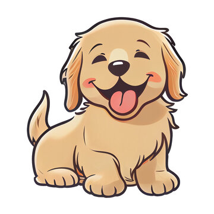
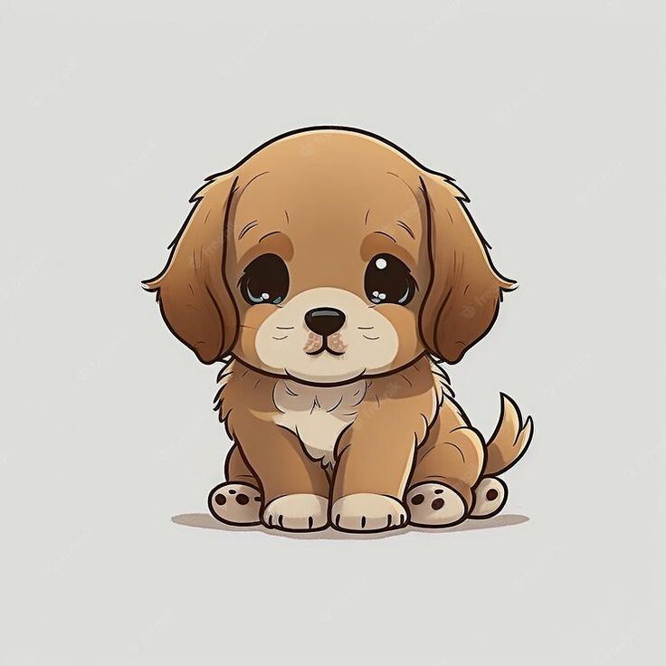
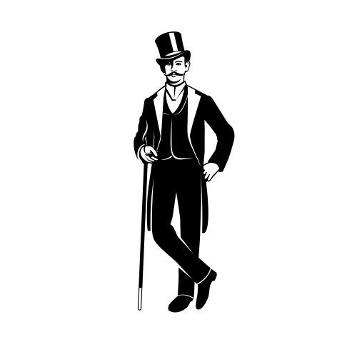

##### Flores Karen 
##### Per. 2 
##### AP Language 
##### T. Luerco

# Diction   and Tone 
- Diction is the ***choice of words*** made by the author
    * Contributes to tone
    * Denotation and Connotation
    * Helps determine tone 
    * Shifts throughout text 
    * What kind of Diction?

- Words can have ***denotation*** and ***connotation*** definition
    * Denotation is dictionary definition
    * Connotation the feeling the word makes 

    - words can be monosyllabic (1 syllable) or polysyllabic (more than one )

        * What am I?
            * Dog (Mono)
            
            * Canine (Poly) 
            

        * What am I?
            * Man (Mono)
                

            * Gentleman (Poly)
                
 
    